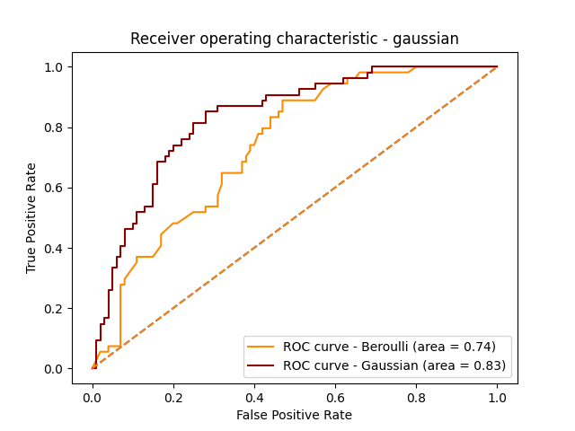

#  Diabetes Prediction with Naive Bayes Classifiers

This open-source Python project performs binary classification using the **Pima Indians Diabetes** dataset. It compares the performance of two **Naive Bayes** classifiers — **BernoulliNB** and **GaussianNB** — for predicting the likelihood of diabetes, and visualizes their performance using **ROC curves** and **AUC scores**.

---

## 📁 Dataset Information

The dataset contains the following features:

| Feature | Description |
|---------|-------------|
| `preg`  | Number of times pregnant |
| `plas`  | Plasma glucose concentration |
| `pres`  | Diastolic blood pressure |
| `skin`  | Triceps skin fold thickness |
| `test`  | 2-Hour serum insulin |
| `mass`  | Body mass index (BMI) |
| `pedi`  | Diabetes pedigree function |
| `age`   | Age |
| `class` | Target variable (0 = non-diabetic, 1 = diabetic) |

---

## ⚙️ Tech Stack

- **Language**: Python 3
- **Libraries**:
  - pandas
  - matplotlib
  - scikit-learn
    - BernoulliNB
    - GaussianNB
    - StandardScaler
    - train_test_split
    - Evaluation metrics: Accuracy, Confusion Matrix, ROC, AUC

---

## 🔄 Workflow Overview

1. **Data Loading**
   - Load `diabetes.csv` using `pandas`

2. **Preprocessing**
   - Split dataset into features (`X`) and labels (`Y`)
   - Normalize features using `StandardScaler`

3. **Train/Test Split**
   - Train: 80%, Test: 20% (random_state=2)

4. **Model Training & Evaluation**
   - Train and evaluate both `BernoulliNB` and `GaussianNB`
   - Output: Confusion matrix, accuracy, ROC-AUC score

5. **Visualization**
   - Plot ROC curves for visual comparison of model performance

---

## 📊 Example Output

```text
Confusion Matrix:
[[84 13]
 [14 39]]

Accuracy: 0.80
```

---

## 📈 ROC Curve Example

ROC curves allow visual assessment of classifier performance.




---


